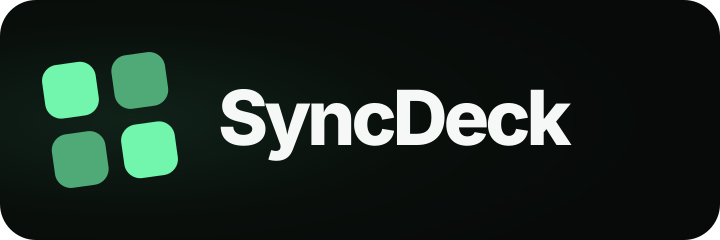
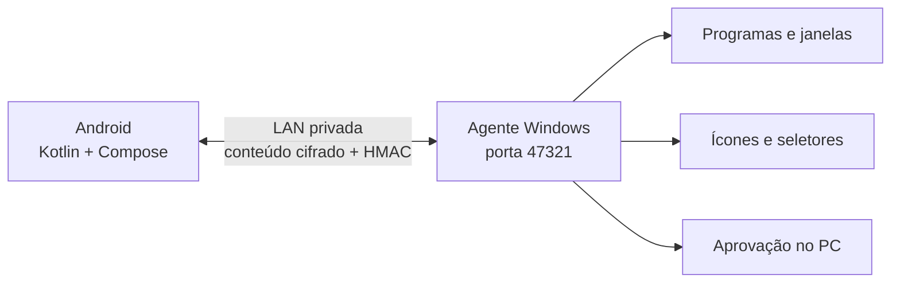

<p align="center">
  
</p>

# SyncDeck

Transforme um celular Android em um painel moderno para abrir, focar e fechar programas, sites, pastas e comandos no Windows. A comunicação é direta na rede local: não existe conta SyncDeck, servidor em nuvem, anúncio ou telemetria.

**Versão:** 1.0.1 · **Licença:** MIT · **Android:** Kotlin + Jetpack Compose · **Windows:** C#/.NET Framework 4.8

> O aplicativo Android 1.0.1 está estruturado para publicação pública na Play Store. A publicação ainda exige uma conta de desenvolvedor, uma chave de upload, materiais da loja e os testes do proprietário descritos em [Publicar na Play Store](docs/PLAY-STORE.md).

## Destaques

- Grade ajustável: 2–4 botões por linha em retrato e 3–6 em paisagem, que continua em tela cheia e somente com logos.
- Ícones reais extraídos automaticamente dos programas instalados no PC.
- Janela aberta destacada por contorno luminoso e quantidade de janelas detectada em tempo real.
- Toque para abrir ou trazer para frente; toque longo para editar; fechamento de uma ou todas as janelas.
- Chrome aberto no perfil ativo ou no último perfil usado.
- Wake-on-LAN para ligar um PC desligado pela rede cabeada.
- Recuperação automática quando o roteador troca o IP do computador.
- Assistente autoexplicativo para adicionar **Programa**, **Site**, **Pasta ou arquivo** ou **Comando**.
- Confirmação no celular e também no PC para comandos e atalhos potencialmente perigosos.

## Como funciona



O Windows mantém os botões e executa as ações. O Android mantém apenas o endereço do PC, o pareamento, o cache de ícones e a configuração Wake-on-LAN. Um novo celular precisa de código temporário e conferência da impressão digital mostrada nas duas telas.

## Requisitos

| Componente | Requisito |
|---|---|
| Android | Android 8.0/API 26 ou superior |
| Windows | Windows 10/11 e .NET Framework 4.8 |
| Rede | Celular no Wi-Fi e PC no mesmo roteador; perfil de rede Windows **Privada** |
| Compilação Android | Android Studio, JDK 17 e Android SDK 36 |
| Wake-on-LAN | Ethernet cabeada, BIOS/UEFI e adaptador compatíveis com Magic Packet em S5 |

## Instalação para desenvolvimento

### 1. Agente Windows

1. Abra a pasta `windows-agent`.
2. Execute `Compilar-e-Iniciar.bat`.
3. Execute `Instalar-no-Windows.bat` para copiar o agente para `%LOCALAPPDATA%\SyncDeck\Agent` e ativar a inicialização automática.
4. Execute `Configurar-Firewall.bat` uma vez como administrador. A regra aceita somente perfil privado e sub-rede local.
5. Procure o símbolo verde do SyncDeck próximo ao relógio do Windows.

O código não inclui um executável pronto no Git. O workflow do GitHub compila o agente e disponibiliza um artefato para testes. Antes de distribuir publicamente, assine o executável com um certificado de assinatura de código.

### 2. Aplicativo Android

1. Abra `android-app` no Android Studio.
2. Aguarde a sincronização do Gradle.
3. Para teste, execute `Gerar-APK.bat` ou use **Run** no Android Studio.
4. Instale `android-app/SyncDeck.apk` no aparelho.
5. Desative novamente **Instalar apps desconhecidos** depois da instalação manual.

Para migrar de uma versão anterior, leia [ATUALIZAR-PARA-1.0.1.txt](ATUALIZAR-PARA-1.0.1.txt).

### 3. Pareamento

1. No ícone do agente, escolha **Parear celular**.
2. No Android, toque em `•••` e informe o IP privado e a porta exibidos no PC.
3. Toque em **Verificar PC**.
4. Compare a impressão digital nas duas telas.
5. Marque a confirmação e digite o código de seis números.

O código expira em cinco minutos e é bloqueado após cinco tentativas. O segredo de 256 bits é gerado no celular, protegido pelo Android Keystore e armazenado no Windows com DPAPI.

## Adicionar botões

Toque em `＋` e escolha uma opção:

| Opção | Experiência |
|---|---|
| Programa | O agente lista os programas instalados; toque em um nome e a imagem será obtida automaticamente |
| Site | Informe o endereço completo e escolha navegador padrão ou Chrome |
| Pasta ou arquivo | Uma janela de seleção é aberta diretamente no PC; não é necessário digitar o caminho |
| Comando | Informe executável e argumentos; salvar e executar sempre pedem autorização visível no PC |

O passo final permite revisar o nome, a cor, a detecção da janela e a confirmação antes de abrir. As opções avançadas ficam recolhidas para não confundir quem só quer criar um botão comum.

## Gestos

| Controle | Resultado |
|---|---|
| Toque no cartão | Abre ou traz a janela para frente |
| `×` | Confirma e fecha normalmente com `WM_CLOSE` |
| Toque longo | Abre ações e edição |
| `＋` | Abre o assistente de novo botão |
| `↻` | Atualiza PC, botões, ícones e estados |
| `•••` | Aparência da grade, conexão, pareamento e revogação local |
| Ligar PC | Envia Magic Packet local após confirmação |

## Segurança e privacidade

O Android solicita somente a permissão `INTERNET`, necessária também para conexões com endereços privados. O código recusa endereços que não sejam IPv4 privados ou link-local.

Proteções principais:

- conferência visual da chave pública durante o pareamento;
- código temporário limitado por tempo e tentativas;
- segredo aleatório de 256 bits, Android Keystore e Windows DPAPI;
- AES-256-CBC com chave derivada e HMAC-SHA-256 sobre o conteúdo cifrado;
- autenticação das respostas antes de interpretar JSON ou imagens;
- timestamp, nonce, comparação em tempo constante e limite de requisições;
- tokens descartáveis vinculando seleções feitas no PC ao botão salvo;
- aprovação no desktop com dispositivo, IP, destino, argumentos e diretório completos;
- firewall restrito à sub-rede local e servidor restrito a IPv4 privado;
- nenhuma coleta de contatos, SMS, arquivos do celular, câmera, microfone, localização ou dados bancários.

O protocolo usa HTTP local porque o agente não depende de certificado ou servidor externo, mas o conteúdo autenticado do Android é cifrado antes de ser enviado. Wake-on-LAN é uma exceção do próprio padrão: o Magic Packet não é autenticado e deve permanecer na rede privada.

Consulte [Segurança](SECURITY.md), [Política de privacidade](PRIVACY-POLICY.md) e [Protocolo](docs/PROTOCOL.md).

## Publicação na Play Store

O projeto já inclui:

- `targetSdk 36`, `versionCode 11` e pacote `com.syncdeck.app`;
- build de release com R8 e redução de recursos;
- suporte opcional a chave de upload em `keystore.properties`;
- `Gerar-AAB.bat` para criar o Android App Bundle;
- ícone adaptativo e monocromático;
- texto da listagem, modelo de Data Safety e política de privacidade;
- CI para teste, lint, APK, AAB e agente Windows.

Antes do primeiro upload, confirme que o identificador `com.syncdeck.app` está disponível e é o identificador permanente desejado. Siga a lista completa em [docs/PLAY-STORE.md](docs/PLAY-STORE.md).

## Desenvolvimento

```powershell
# Validar estrutura, versões, políticas e vetores criptográficos
python scripts/validate_repository.py

# Android
cd android-app
.\gradlew.bat testDebugUnitTest lintRelease assembleDebug bundleRelease

# Windows
windows-agent\build-agent.bat
```

O Android usa AGP 9.0.1, Kotlin 2.2.10, Jetpack Compose e Java 17. O agente usa somente APIs do .NET Framework incluídas no Windows. Os workflows também compilam o projeto iOS experimental em um executor macOS.

## Aplicativo iOS experimental

A pasta `ios-app` preserva o cliente SwiftUI 0.5.0 para iOS 15 e iPhone 11 Pro. Ele pode ser compilado pelo GitHub sem assinatura e instalado pelo Windows com uma assinatura pessoal, conforme [INSTALAR-NO-IPHONE.txt](INSTALAR-NO-IPHONE.txt). O foco de publicação 1.0.1 é o aplicativo Android; o cliente iOS ainda não é uma distribuição oficial da App Store.

## Estrutura

- `android-app/`: Kotlin, Jetpack Compose, Gradle e recursos Android.
- `windows-agent/`: agente C#, catálogo de programas, aprovação e integração Win32.
- `ios-app/`: cliente SwiftUI experimental.
- `brand/`: logo, símbolo e guia de identidade visual oficial.
- `tests/`: vetores determinísticos do protocolo.
- `scripts/`: validação, build e empacotamento.
- `docs/`: arquitetura, protocolo, ações, testes, releases e publicação.
- `store-assets/`: materiais não secretos para a listagem.

## Documentação

| Documento | Conteúdo |
|---|---|
| [Arquitetura](docs/ARCHITECTURE.md) | Componentes, confiança e fluxos |
| [Ações](docs/ACTIONS.md) | Tipos e validações dos botões |
| [Protocolo](docs/PROTOCOL.md) | Pareamento, criptografia e rotas |
| [Desenvolvimento](docs/DEVELOPMENT.md) | Ambiente e contribuição |
| [Testes](docs/TESTING.md) | CI e matriz manual |
| [Releases](docs/RELEASING.md) | Versionamento e artefatos |
| [Play Store](docs/PLAY-STORE.md) | AAB, assinatura e Console |
| [Data Safety](docs/DATA-SAFETY.md) | Respostas propostas para o formulário |
| [Texto da loja](docs/STORE-LISTING.md) | Nome, descrições e imagens |
| [Wake-on-LAN](docs/WAKE-ON-LAN.md) | BIOS, Realtek e diagnóstico |
| [Troubleshooting](docs/TROUBLESHOOTING.md) | Erros e soluções |

## Contribuição e licença

Issues e Pull Requests são bem-vindos. Leia [CONTRIBUTING.md](CONTRIBUTING.md), [CODE_OF_CONDUCT.md](CODE_OF_CONDUCT.md) e [SECURITY.md](SECURITY.md).

Distribuído sob a [Licença MIT](LICENSE). Copyright © 2026 Erick Carmo.
