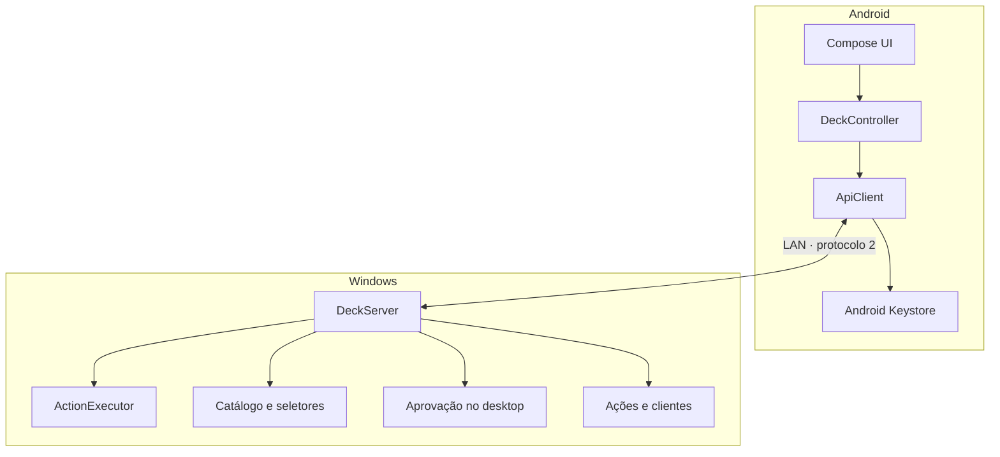
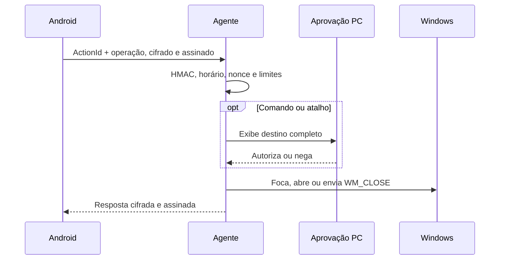

# Arquitetura

O SyncDeck separa apresentação e execução. O Android mostra o painel; o agente Windows mantém as ações autorizadas, observa janelas e interage com o sistema. Não existe backend SyncDeck.

## Visão geral

O HTTP/1.1 é somente a moldura de transporte local. No cliente Android 1.0, todo conteúdo autenticado é cifrado e recebe HMAC antes de atravessar a rede.

## Android

| Arquivo | Responsabilidade |
|---|---|
| `MainActivity.kt` | Tema, painel responsivo, animações, cartões, gestos e diálogos |
| `DeckController.kt` | Estado único da tela, polling, reconexão, confirmações e Wake-on-LAN |
| `ActionWizard.kt` | Fluxo guiado Programa/Site/Pasta/Comando |
| `ApiClient.kt` | Rede, pareamento, descoberta pelo fingerprint, catálogo, ícones e Magic Packet |
| `Security.kt` | Android Keystore, AES-GCM local, HMAC e cifra do protocolo 2 |
| `Models.kt` | Modelos imutáveis e conversão JSON |

A interface usa Kotlin e Jetpack Compose. A pessoa escolhe entre 2–4 colunas em retrato e 3–6 em paisagem; o modo paisagem oculta o cabeçalho e mostra somente logos. O toque longo abre o menu do cartão.

`DeckController` é a fronteira entre UI e rede. Callbacks do `ApiClient` retornam ao thread principal antes de alterar o estado Compose. Operações de disco, rede e criptografia não são executadas no thread da interface.

## Windows

| Classe | Responsabilidade |
|---|---|
| `AgentContext` | Bandeja, ciclo de vida, pareamento, revogação e inicialização automática |
| `DeckServer` | HTTP limitado, autenticação, cifra, rate limit e roteamento |
| `DesktopSecurity` | Confirmações independentes e seletores nativos no desktop |
| `CatalogService` | Programas instalados e tokens de seleção descartáveis |
| `ActionExecutor` | Abrir, focar, fechar e executar uma ação já salva |
| `WindowInspector` | Relacionar ações a janelas Win32 visíveis |
| `ChromeProfileResolver` | Reutilizar perfil Chrome ativo ou usado por último |
| `IconResolver` | Extrair ou gerar PNGs para os botões |
| `ActionStore` / `ClientStore` | Validar ações e persistir clientes com DPAPI e backup atômico |

O agente usa C# compatível com .NET Framework 4.8 para funcionar em Windows 10/11 sem instalar um runtime adicional. Um mutex impede duas instâncias simultâneas.

## Fluxo de uma ação

O celular nunca envia um executável diretamente para `/api/execute`; envia apenas o ID de uma ação que já existe no Windows. Comandos e atalhos exigem confirmação no Android e aprovação independente no PC a cada execução.

## Criação de botão

1. **Programa:** o agente consulta App Paths e Menu Iniciar, retorna até 100 opções e cria um token temporário.
2. **Pasta/arquivo:** o agente abre um seletor nativo; o caminho escolhido recebe token equivalente.
3. **Site:** o Android valida HTTP/HTTPS e pode optar pelo Chrome.
4. **Comando:** argumentos ficam separados do executável e sempre exigem aprovação no PC.
5. Ao salvar, o agente valida novamente todos os campos. O token dura cinco minutos, vale uma vez e está vinculado ao dispositivo, tipo e destino.

Qualquer criação não confiável ou alteração de tipo, destino, argumentos, diretório de trabalho ou fallback sensível abre a confirmação no desktop.

## Estado das janelas

O Android consulta `/api/actions/state` enquanto a tela está ativa. O agente faz uma captura de janelas visíveis com `EnumWindows`, ignora superfícies do shell e processos sem janela e responde somente com ID, booleano aberto e quantidade. Títulos permanecem no PC.

Ao abrir uma ação, o agente primeiro tenta restaurar e trazer a janela existente para frente. O fechamento usa `WM_CLOSE`, permitindo que o programa peça para salvar. Quando há várias janelas, o Android pergunta se deve fechar uma ou todas.

## Persistência

| Local | Conteúdo |
|---|---|
| Android Keystore | Chave AES não exportável que protege o segredo de pareamento |
| SharedPreferences privadas | Endpoint, UUID, fingerprint, segredo cifrado e Wake-on-LAN |
| Cache Android | PNGs de ícones; pode ser apagado sem perder configuração |
| `%LOCALAPPDATA%\SyncDeck\actions.json` | Definições dos botões |
| `%LOCALAPPDATA%\SyncDeck\clients.json` | Clientes com segredo protegido por DPAPI `CurrentUser` |
| `%LOCALAPPDATA%\SyncDeck\clients.backup.json` | Backup recuperável do pareamento |
| `%LOCALAPPDATA%\SyncDeck\settings.json` | Porta e preferência de inicialização |

Quando o endereço salvo não responde, o Android examina por tempo limitado os IPv4 privados locais e aceita somente o agente com o mesmo fingerprint já pareado.

## Limites de confiança

- Somente IPv4 privado, loopback ou link-local; não há controle pela internet.
- A LAN não é considerada secreta: HMAC, cifra, nonce e timestamp protegem o canal Android.
- O agente executa com os direitos do usuário conectado; não eleva privilégio.
- Uma sessão Windows bloqueada continua bloqueada, e janelas elevadas podem recusar foco.
- O Magic Packet não possui autenticação e apenas liga hardware compatível; não contorna PIN, senha ou BitLocker.
- Um Android ou Windows já comprometido está fora do modelo de ameaça.

## Cliente iOS experimental

O cliente SwiftUI 0.5 continua no repositório para uso pessoal e compatibilidade. Ele usa o protocolo HMAC legado, sem a cifra de conteúdo v2, e não faz parte da publicação Android 1.0 na Google Play.
